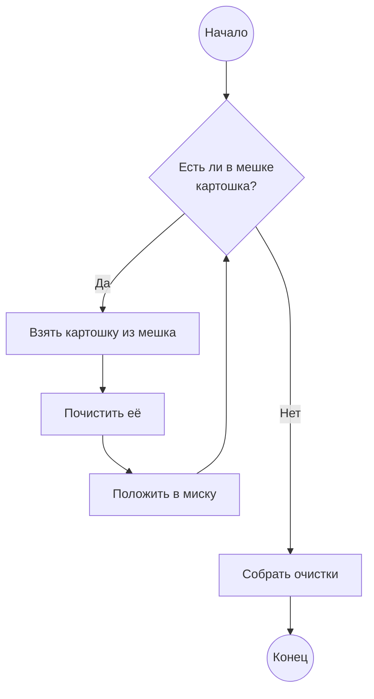

# Алгоритмы

Алгоритм --- чёткая инструкция для достижения какого-нибудь результата. Сложение и умножение чисел в столбик --- алгоритм.
Рецепт (если он хороший) --- алгоритм приготовления блюда. А что такое хороший рецепт?

**Хороший рецепт:**
> 1. Разогреть духовку до 210 градусов
> 2. Выложить на решётку чевапчичи
> 3. Поставить на полку противень (для сбора жира), а на него --- решётку
> 4. Запекать 25 минут

А плохой?

> Жарить чевапчичи до готовности

Каждый шаг хорошего рецепта понятен и вполне однозначен, а единственный шаг плохого рецепта содержит лишь какие-то общие указания.

Кроме того, хороший рецепт подразумевает, что исполнитель однозначно понимает все шаги, из которых он состоит,
и умеет их выполнять (так, как это представлял автор рецепта). Поэтому для человека, который умеет разогревать духовку, выкладывать продукты
на решётку и засекать время, _хороший рецепт_ вполне будет алгоритмом.

Обычно алгоритмы решают целое семейство сходных задач. Например, с помощью сложения в столбик
можно сложить любые два числа, порядок действий от этого не изменится. Алгоритм "разложить в алфавитном порядке"
одинаково пригоден и для сортировки специй, и для сортировки книг.

Часто бывает так, что какой-нибудь более сложный алгоритм включает в качестве шага какой-то более простой. На кухне
такое, впрочем, встречается нечасто, а вот в математике --- запросто. Например, чтобы перемножить два числа в столбик,
в конце придётся сложить (обычно тоже в столбик) частичные произведения.

Бывает так, что некоторые шаги нужно повторять до достижения определённого результата. Например, как почистить мешок картошки:
> 1. Если в мешке не осталось картошки, перейти к шагу 6
> 2. Взять картошку из мешка
> 3. Почистить её
> 4. Положить её в миску-с-чищеной-картошкой
> 5. Перейти к шагу 2
> 6. Собрать очистки

Шаги 2-5 этого алгоритма будут повторяться до тех пор, пока вся картошка не будет почищена.

Такой алгоритм можно представить в виде _блок-схемы_ (на ней хорошо видно это повторение):

Бывает даже так, что какой-то алгоритм включает в качестве шага самого себя --- это называется рекурсией. Правда, с этим
нужно быть аккуратным, потому что его исполнение может никогда не закончиться. Классический пример --- вычисление N-ного числа Фибоначчи.
Ряд Фибоначчи начинается с двух единиц, а далее каждое следующее число равно сумме двух предшествующих:

\\[ 1, 1, 2, 3, 5, 8, 13, 21, 34, 56... \\]

**Как вычислить N-ное число Фибоначчи**
> 1. Если `N < 1` --- таких чисел нет. Ошибка.
> 2. Если `N = 1` или `N = 2` --- ответ равен 1. Дальше делать ничего не надо
> 3. Вычислить N-1-ое число
> 4. Далее вычислить N-2-ое число
> 5. Сложить эти два числа, это и будет ответ

Во всех случаях алгоритмы подразумевают исполнителя, который должен понимать команды и уметь их правильно исполнять. При этом что по сути 
он собою представляет --- не важно: рецепту может следовать и шеф, и поварёнок, и простая домохозяйка, а алгоритму вычисления чисел Фибоначчи
может следовать и компьютер, и человек с калькулятором. Важно только, чтобы все одинаково понимали набор команд.

В следующем разделе рассмотрим, что же умеет типичный исполнитель-компьютер.