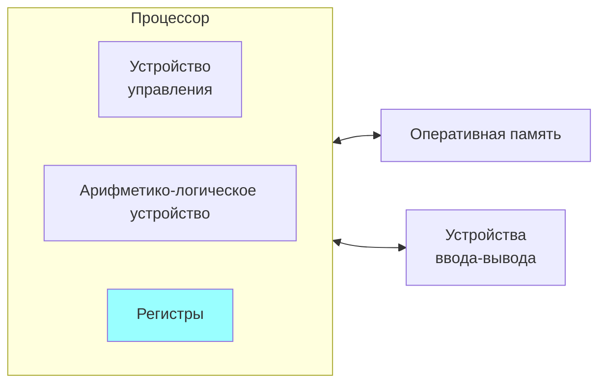

# Как работает компьютер

> Любая достаточно развитая технология неотличима от магии  
> (_третий закон Артура Кларка_)

Компьютеры умеют только одно: производить разные операции над нулями и единицами.

Но, во-первых, этих нулей и единиц _много_ (порядка сотни миллиардов, если учитывать только оперативную память), 
а во-вторых, делают они это очень _быстро_ (миллиарды операций в секунду). Поэтому нам кажется, что происходит 
какая-то магия. Эту магию мы можем увидеть, услышать или ощутить благодаря всяким дополнительным приспособлениям 
(устройствам ввода-вывода), с помощью которых вычислительная машина может взаимодействовать с внешним миром (и с нами).

Схематически компьютеры с момента самого их изобретения устроены следующим образом 
(эта схема называется [архитектурой фон Неймана](https://ru.wikipedia.org/wiki/%D0%90%D1%80%D1%85%D0%B8%D1%82%D0%B5%D0%BA%D1%82%D1%83%D1%80%D0%B0_%D1%84%D0%BE%D0%BD_%D0%9D%D0%B5%D0%B9%D0%BC%D0%B0%D0%BD%D0%B0)):

Для чего нужны все эти части?

## Процессор и его части

Арифметико-логическое устройство занимается арифметикой (складывает, вычитает, умножает, делит и т.п.)
и логикой (сравнивает значения, выполняет дизъюнкцию, конъюнкцию и другие логические операции).

У процессора есть небольшое количество (порядка пары дюжин) _регистров_, в которых хранятся
промежуточные результаты вычислений (и сравнений) и другие важные вещи, например,
по какому адресу памяти нужно читать следующую команду.

Ключевая часть компьютера --- устройство управления, которое командует почти всем остальным. 
Без него компьютер превратился бы в арифмометр, который работает только тогда, когда человек 
нажимает кнопки и крутит ручку. Устройство управления командует и само собой, читая из оперативной памяти команды и исполняя их.

Команды могут быть разными, например:
* Прочитать какое-нибудь значение из памяти и записать его в один из регистров
* Сложить числа из регистров
* Отправить какую-нибудь команду на одно из устройств вывода
* Перейти на какой-то другой адрес и начать читать команды оттуда

Собственно, последовательность таких команд и составляет программу. Сами команды, разумеется, тоже кодируются нулями и единицами.

## Память
Оперативная память (часто просто “память”) состоит из множества ячеек, каждая из которых может хранить целое число от 0 до 255.
У каждой ячейки есть свой номер --- он называется адресом. В оперативной памяти хранится всё, что нужно для работы компьютера прямо сейчас. 

## Устройства ввода и вывода

Устройства ввода и вывода нужны для взаимодействия компьютера с внешним миром: без этого он не сможет
делать ничего полезного. Устройства ввода, например, --- это клавиатура и мышь, устройство вывода — монитор.

**NB**: жёсткий диск (SSD, флешка) — это не часть оперативной памяти, а одно из устройств ввода-вывода.
Когда мы открываем какой-либо файл, то сначала процессор просит жёсткий диск скопировать данные с какого-то
определённого места диска в память, а когда сохраняем — наоборот, записать данные обратно на диск. 

## Как выглядят программы

Программа может выглядеть, например, так:
1. загрузи в регистр `A` число из памяти адресу 1
2. загрузи в регистр `B` число из памяти по адресу 2
3. сравни число из регистра `A` с числом из регистра `B`
4. если первое число меньше, перейди к шагу 7
5. уменьши число в регистре `А` на число в регистре `B` (то есть в `A` будет `A - B`)
6. перейди к шагу 3
7. положи в память содержимое регистра `A` по адресу 3

А <a href=" http://tpcg.io/_B2WE09" target="_blank">вот как это выглядит</a> в виде настоящей программы. Наверху есть кнопка `Execute`, 
а внизу кода можно поменять начальные значения в ячейках `num1` и `num2`.

Допустим, по адресу 1 расположено число 7, а по адресу 2 --- число 3. Рассмотрим выполнение программы по шагам:

| Шаг | № ком. | Команда                   | № след. | `A` | `B` | Результат сравнения |
|-----|--------|---------------------------|---------|-----|-----|--------------------------|
| 1   | 1      | Ячейка 1 → `A`            | 2       | 7   |     |                          |
| 2   | 2      | Ячейка 2 → `B`            | 3       | 7   | 3   |                          |
| 3   | 3      | Сравнить `A < B`          | 4       | 7   | 3   |                          |
| 4   | 4      | Если так, перейти к **7** | 5       | 7   | 3   | нет                      |
| 5   | 5      | `A - B` → `A`             | 6       | 4   | 3   | нет                      |
| 6   | 6      | Перейти к **3**           | 3       | 4   | 3   | нет                      |
| 7   | 3      | Сравнить `A` < `B`        | 4       | 4   | 3   | нет                      |
| 8   | 4      | Если так, перейти к **7** | 5       | 4   | 3   | нет                      |
| 9   | 5      | `A - B` → `A`             | 6       | 1   | 3   | нет                      |
| 10  | 6      | Перейти к **3**           | 2       | 1   | 3   | нет                      |                 
| 11  | 3      | Сравнить `A < B`          | 4       | 1   | 3   | да                       |
| 12  | 4      | Если так, перейти к **7** | 5       | 1   | 3   | да                       |
| 13  | 7      | `A` → Ячейка 3            | (конец) | 1   | 3   | да                       |

В этом случае программа вычислила остаток от деления числа 7 на число 3, вычитая из одного другое до тех пор, пока это возможно.

### Контрольный вопрос
> Что случится, если в ячейке `2` будет записан ноль?
