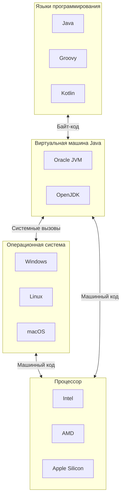

# Абстракции и виртуальные машины

Писать программы в виде непосредственно команд для процессора весьма и весьма накладно, потому что
кроме арифметики и логики нужно заниматься вводом и выводом, а как именно это делать --- зависит
буквально всего, начиная от модели монитора и заканчивая тем, в какой именно порт воткнута клавиатура.

И здесь на помощь приходит идея абстрагирования. Поясним её на кулинарном примере.
Когда в рецепте написано "вскипятить воду", совершенно безразлично, каким именно способом 
это будет происходить. Один вскипятит воду в чайнике, другой в кастрюльке,
третий в микроволновке, четвёртый на костре, пятый скомандует помощникам и т. п.
Это некая абстракция, которая специфицирует результат, но не способ его достижения.

И именно такие абстракции очень нужны программистам. Например: "выведи строку" (неважно, на какой экран, может, 
вообще на принтере напечатать) или "прочитай файл по такому-то пути" (на диске, на флешке, по сети и т. п.),
и нужен некий _слой абстракции_, который возьмёт на себя все конкретные шаги по достижению какого-либо результата.

Для этого существует операционная система (ОС). Она берёт на себя взаимодействие с железом,
и вместо непосредственно команд ввода-вывода предоставляет программисту новые команды (они называются 
системными вызовами). Вместо того чтобы обращаться к видеокарте и монитору, программист просит ОС "напечатать на экране",
вместо обращения к жёсткому диску --- "прочитай мне файл с таким-то именем", и так далее. Кроме того, операционная 
система позволяет писать программу, не задумываясь о том, что вместе с этим могут работать какие-то другие программы,
и множество всего прочего.

Но программисты редко работают напрямую с системными вызовами. Дело в том, что даже разные версии системы могут иметь 
несколько различающиеся соглашения по этому поводу, а уж у разных ОС (например, Windows и Linux) системные вызовы
совсем разные. Поэтому здесь нужен ещё один слой абстракции, который обычно предоставляется программисту
каким-либо языком программирования, и он скрывает от него все сложности взаимодействия с операционной системой.

Таким образом команда "напечатай строку на экране" в зависимости от ОС превращается в разные системные вызовы,
а в зависимости от железа ОС делает разные вещи, но обо всём этом программисту обычно думать не нужно.

С другой стороны, чтобы что-нибудь вычислить, операционная система не нужна, и здесь язык программирования
помогает программисту абстрагироваться от конкретных арифметических команд конкретного процессора.

## Виртуальные машины

Идея абстрагирования имеет и другие интересные применения. Например, если очень хочется запустить какую-нибудь
программу, написанную для отсутствующей железки (например, Sega), то достаточно написать эмулятор, который будет
исполнять команды так же, как это делает нужная железка, создав таким образом _виртуальную машину_ (приставка --- тоже машина).

Но кто сказал, что виртуальная машина должна обязательно соответствовать какой-то имеющейся системе? 
Можно ведь придумать свой удобный набор команд ("байт-код"), а затем реализовать его эмуляторы для всех нужных систем. 
Именно так работает Java: программы на ней распространяются в виде кода для специальной 
виртуальной машины (Java Virtual Machine, JVM), а для каждой целевой системы существуют реализации JVM.
Более того, есть несколько альтернативных реализаций JVM. А ещё на базе JVM можно писать программы не только на 
Java, но и на других языках.

Поскольку к этому моменту уже ничего не понятно, нарисуем слоистый пирог абстракций:

Как это понимать?

Программу, написанную на любом из этих языков, может выполнить любая виртуальная машина Java. Она, в свою очередь,
может работать на разных операционных системах, который могут работать на разном оборудовании. И благодаря тому,
что на каждом уровне правила строго определены, большую часть времени программисту вообще не нужно думать, 
как это работает на самом деле.

## Глубже и выше

Пирог можно растить в обоих направлениях. Если речь идёт о программировании хоть сколько-нибудь сложной системы,
то программисты сами наращивают абстракции. Например, брать деньги за какую-нибудь услугу можно разными способами,
но с точки зрения процесса купли-продажи способ неважен, поэтому этот процесс прячется за абстракцией "платёжа".

Более изощрённый пример: существует, например, Jython --- реализация языка Python, написанная на Java. 
А на Python написан эмулятор эзотерического языка программирования [Befunge](https://ru.wikipedia.org/wiki/Befunge).
Но это уже из области ненормального программирования.

С другой стороны, вместо реального процессора можно подсунуть эмулируемый. Но на деле всё обстоит даже интереснее:
многие современные процессоры на самом деле внутри содержат специальную программу ([микрокод](https://ru.wikipedia.org/wiki/Микрокод)),
которая на самом деле исполняет "в железе" все команды.

Ну и в железе есть ещё пара слоёв абстракций, которые скрывают от разработчиков логических схем процессора реальные 
физические явления. И всё это как-то работает!