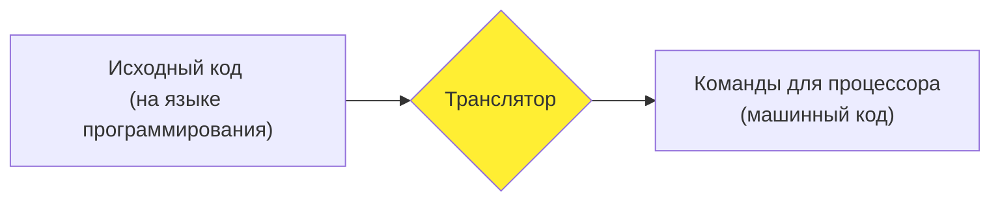

# Языки программирования

Сосредоточимся теперь на языках программирования. Они позволяют писать программы на более "человеческом" языке. 
Затем с помощью специальной программы  то, что написано в "человечьем" виде превращается в команды для машины.
Выглядит это так:

_Исходный код_ --- текст, написанный по специальным правилам языка программирования. _Транслятор_ "переводит"
его с языка программирования в последовательность команд для процессора (_машинный код_) или для виртуальной машины (_байт-код_).

Детали работы транслятора сейчас совершенно не важны. Важно, что делать это можно двумя разными способами:
или один раз заранее, или каждый раз при запуске программы.

## Виды трансляции
### Компиляция
_Компиляция_ --- преобразование исходного кода в машинный _заранее_. Это происходит, как правило,
на компьютере разработчика, и, таким образом, пользователь не имеет доступа к исходному коду программы (и без специальных
навыков ему очень сложно что-то там подкрутить).

### Интерпретация
_Интерпретация_ --- преобразование исходного кода в машинный прямо в процессе работы программы. Поэтому для работы программы
каждый раз нужен _интерпретатор_. Из-за того, что трансляция происходит каждый раз во время работы программы, оно в целом
работает медленнее, чем в случае компиляции. Зато программисту нужно гораздо меньше думать о том, на какой именно системе
будет работать его программа. 

Виртуальные машины размывают грань между интерпретацией и компиляций. Например, традиционно считается, что язык
Java --- компилируемый, а Python --- интерпретируемый. На самом деле, оба они основаны на виртуальных машинах, вот
только в случае Java виртуальная машина существует и распространяется отдельно от транслятора, а в случае Python они объединены.

Компилируемые языки обычно в целом более строгие и требовательные к программисту (потому что программу нужно скомпилировать
"раз и навсегда"), а интерпретируемые отличаются большей гибкостью.

## REPL
Интерпретируемые языки обычно содержат так называемый REPL --- Read-Eval-Print Loop. Это специальная
программа, которая читает (read) с клавиатуры какую-нибудь очередную команду языка программирования, сразу же исполняет (evaluate) её
и выводит (print) результат. Потом процесс повторяется заново. Это очень удобно для того, чтобы разобраться в чём-нибудь,
например, в процессе обучения.

В дистрибутиве Python есть специальный инструмент --- IPython, который как раз реализует эту парадигму. Осталось его запустить и читать следующий раздел.