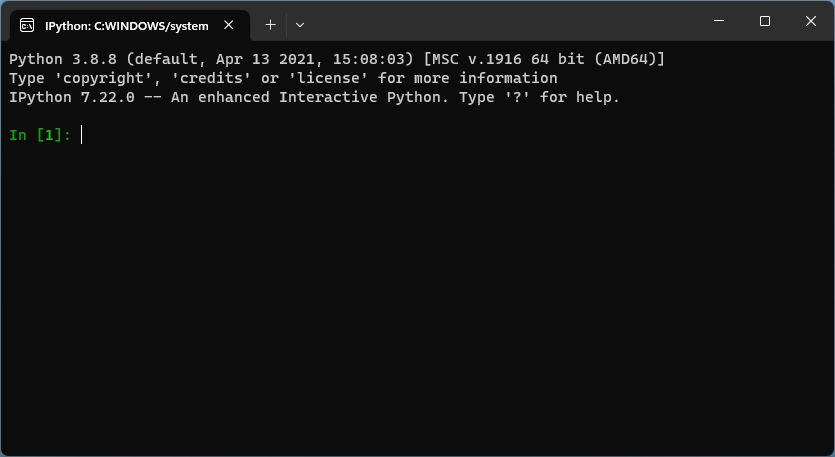

# Как выглядит IPython

IPython (Interactive Python) --- отличный инструмент для обучения, быстрой проверки чего-нибудь и т. п.
При запуске он выглядит как-то так:

и приветливо ожидает ввода команд (надпись `In [1]:` называется prompt --- приглашением).

Сверху написана всякая служебная информация, из которых главное --- версия Python (на скриншоте --- 3.8.8).

Здесь же следует сделать лирическое отступление и рассказать немного о чёрном (или белом) окошке с буквами,
которое именуется эмулятором терминала или же просто терминалом.

> Исторически терминал --- это клавиатура-с-монитором (а ещё раньше --- клавиатура-с-принтером). К большой ЭВМ,
которая могла занимать целый машинный зал, были присоединены одно или несколько таких устройств, и несколько
пользователей могли работать одновременно, не мешая друг другу. С точки зрения ЭВМ это устройство ввода-вывода,
которое умеет вводить и выводить текст. Изначально они были монохромные (точнее, чёрно-зелёные и чёрно-оранжевые),
а уже много позже обрели целых 16 цветов.
> 
> Эта концепция оказалась настолько живучей, что в любом современном компьютере есть эмулятор терминала, который
обеспечивает возможность взаимодействовать с компьютером с помощью текста.

IPython ждёт, что пользователь введёт строку кода на Python, тогда выполнит её, выведет результат исполнения
и будет ждать следующую строку.